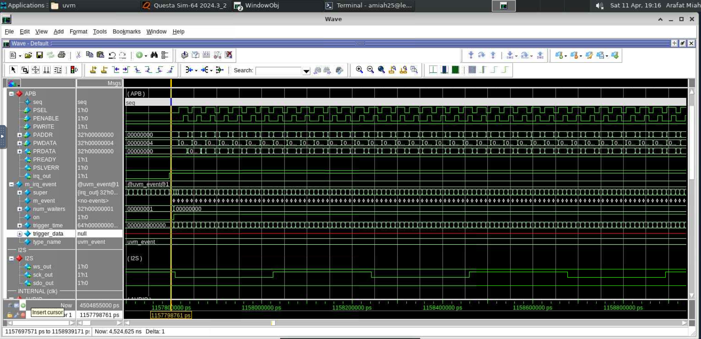
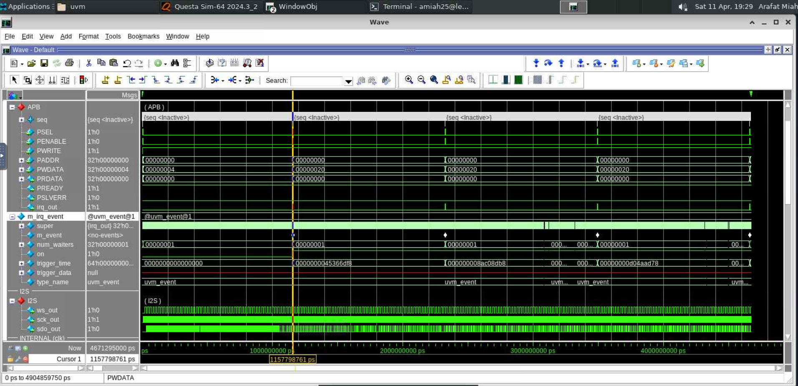
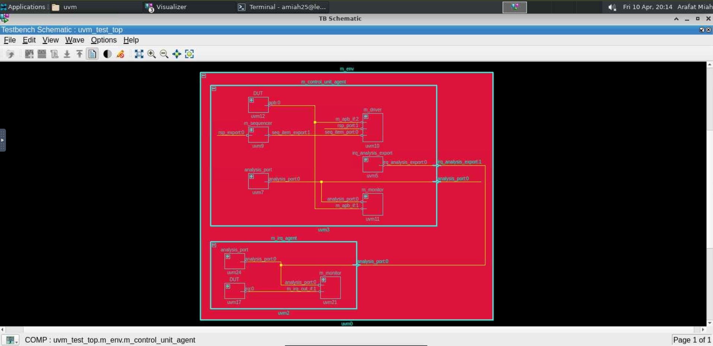

# Week 14: UVM Testbench & Interrupt Handling for Audio Control Unit

## 📖 What is this week about?
The primary objective of Week 14 was to transition a legacy SystemVerilog testbench into a modern, fully object-oriented **Universal Verification Methodology (UVM)** framework. 

Moving to UVM represents a steep learning curve in verification engineering. The core challenge this week was mastering UVM component hierarchy and **Transaction Level Modeling (TLM)** to synchronize hardware and software. Specifically, the environment needed to correctly initialize an audio control unit via an APB bus, put the software sequence to sleep, and dynamically wake it up to send bursts of audio data only when the physical hardware asserted an interrupt (`irq_out`).

## 🛠️ What I Created
To achieve this, I built the UVM hierarchy from the ground up. All code was written from scratch after studying the structural differences of the UVM framework.

* **`control_unit_agent`**: I extended the standard UVM agent to include an `irq_analysis_export`. This allows the agent to receive interrupt transactions from an external monitor and translate them into a software `uvm_event` that sequences can listen to.
* **`control_unit_env`**: The container environment. I used the UVM factory (`type_id::create`) to instantiate both the `control_unit_agent` and a dedicated `irq_agent`, and physically connected their TLM ports in the `connect_phase`.
* **`control_unit_sequence`**: The "brain" of the test. To adhere to clean software principles (DRY), I created a custom `write_apb` helper task to handle the standard `start_item()`/`finish_item()` UVM handshaking. The sequence initializes the device, then enters a loop where it halts execution using `irq_event.wait_trigger()` until the hardware demands more data.
* **`control_unit_uvm_test`**: The top-level test class that builds the environment, raises/drops simulation objections, and executes the sequence on the agent's sequencer.

## 📊 Results & Proof of Concept
The testbench was compiled and simulated using Siemens QuestaSim. The simulation waveforms provided in this repository definitively prove that the UVM hardware-software handshake operates flawlessly:

1. **Textbook Interrupt Handling**: The zoomed-in waveform proves that at the exact moment the physical chip's FIFOs run low and assert the `irq_out` signal, the software sequence detects it. You can see the `num_waiters` variable instantly drop from `1` to `0`, meaning the sequence woke up. Immediately after, the sequence drives a rapid, dense burst of transactions across the APB bus to refill the FIFOs.

2. **System Stability**: The zoomed-out waveform proves the macro-level stability of the design. Because the UVM environment dynamically and efficiently services every hardware interrupt, the chip never starves for data. This is proven by the continuous, uninterrupted toggling of the I2S audio output signals (`ws_out`, `sck_out`, and `sdo_out`) over time.

3. **Architecture Verification**: The visualizer schematic confirms that all UVM components were instantiated correctly and that the yellow TLM analysis port wires were successfully routed between agents.

## 📂 Repository Files
*(Note: SystemVerilog header files have been uploaded as `.txt` for easy repository viewing).*

* `control_unit_agent.txt` - APB driver, sequencer, monitor, and IRQ export handling.
* `control_unit_env.txt` - UVM Environment and TLM connection phase.
* `control_unit_sequence.txt` - The stimulus generation and dynamic interrupt-servicing logic.
* `control_unit_uvm_test.txt` - Top-level execution and objection handling.
* `control_unit_uvm_test_env.jpg` - Schematic of the UVM hierarchy.
* `control_unit_uvm_test_irq.jpg` - Waveform showing micro-level interrupt response.
* `control_unit_uvm_test.jpg` - Waveform showing macro-level I2S audio streaming.

## 🧠 What I Learned This Week

* **Building with UVM:** I learned how to move away from basic test scripts and build a professional, modular testing environment using UVM components (like Agents, Environments, and Sequences).
* **Hardware & Software Communication:** I learned how to make the software wait for the physical hardware. Instead of guessing when to send data, the software pauses and waits for the hardware's interrupt pin (`irq_out`) to signal that it needs more audio data.
* **Connecting Pieces (TLM):** I learned how to pass messages between different parts of the code (like sending the interrupt signal from the monitor to the sequence) cleanly, without tangling the code together.
* **Writing Cleaner Code:** I practiced writing reusable "helper tasks" (like my `write_apb` function). This kept my main sequence clean, short, and much easier to read or debug.
* ## Disclaimer
This repository contains **only a portion of the full laboratory project** and is shared **solely for demonstration and portfolio purposes**.

It is **not intended to be used as a solution reference** for academic coursework or assessments.  
Any reuse should be for learning or professional evaluation only.

---

## Author
**Arafat Miah**  
Digital Design
* **Sequence Abstraction & DRY Principles:** Improved object-oriented coding practices by wrapping standard, repetitive UVM handshakes (`start_item()` / `finish_item()`) into reusable helper tasks (like `write_apb`). This keeps the sequence logic clean, scalable, and focused on the actual test intent rather than UVM boilerplate code.

